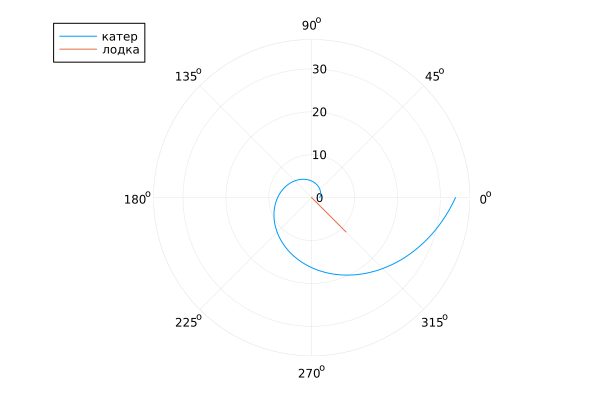

**РОССИЙСКИЙ УНИВЕРСИТЕТ ДРУЖБЫ НАРОДОВ**

**Факультет физико-математических и естественных наук**

**Кафедра прикладной информатики и теории вероятностей**

**ОТЧЕТ** 

**ПО ЛАБОРАТОРНОЙ РАБОТЕ № 2**

*дисциплина:	Математическое моделирование*	 

Студент:   Тозе Витор Ф                                  

`	`Группа: НФИбд-02-21                                      

**МОСКВА**

2024 г.

**Цель работы:**

На море в тумане катер береговой охраны преследует лодку браконьеров.

Через определенный промежуток времени туман рассеивается, и лодка

обнаруживается на расстоянии 6,4 км от катера. Затем лодка снова скрывается в

тумане и уходит прямолинейно в неизвестном направлении. Известно, что скорость

катера в 2,4 раза больше скорости браконьерской лодки.

1\. Запишите уравнение, описывающее движение катера, с начальными 

условиями для двух случаев (в зависимости от расположения катера 

относительно лодки в начальный момент времени). 

2\. Постройте траекторию движения катера и лодки для двух случаев.

3\. Найдите точку пересечения траектории катера и лодки

1. Установить JULIA

1. Код программы :

using DifferentialEquations

using Plots

n=2.4

s = 6.4

fi = 3/4\*pi

function f(r, p, t)

`    `dr = r/sqrt(n^2-1)

`    `return dr

end

function f2(t)

`    `xt = tan(fi+pi)\*t

`    `return xt

end

r0 = s/(n+1)

theta0 = collect(LinRange(0, 2\*pi, 10000))

prob = ODEProblem(f, r0, (0, 2\*pi))

sol = solve(prob, saveat=theta0)

t = collect(LinRange(0.000000001, 8, 1000))

r1=[]

tetha1=[]

for i in t

`    `push!(r1, sqrt(i^2 + f2(i)^2))

`    `push!(tetha1, atan(f2(i)/i))

end

plot(sol, proj=:polar, label="катер")

plot!(tetha1, r1, proj=:polar, label="лодка")

savefig("01jl.png")

r0 = s/(n-1)

theta0 = collect(LinRange(0, 2\*pi, 10000))

prob = ODEProblem(f, r0, (0, 2\*pi))

sol = solve(prob, saveat=theta0)

t = collect(LinRange(0.000000001, 15, 1000))

r1=[]

tetha1=[]

for i in t

`    `push!(r1, sqrt(i^2 + f2(i)^2))

`    `push!(tetha1, atan(f2(i)/i))

end

plot(sol, proj=:polar, label="катер")

plot!(tetha1, r1, proj=:polar, label="лодка")

savefig("02jl.png")

1. Результаты

01jl.png

02jl.png

